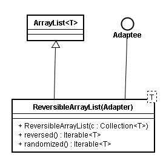

TIJ-AdapterMethodIdiom-用适配器模式包装iterator接口。对P243也代码进行了修改后

```java
//  : holding/AdapterMethodIdiom.java
//  The "Adapter Method" idiom allows you to use foreach
//  with additional kinds of Iterables.
import java.util.*;

class ReversibleArrayList<T> extends ArrayList<T> {
  public ReversibleArrayList(Collection<T> c) {
    super(c);
  }

  public Iterable<T> reversed() {
    return new Iterable<T>() {
      public Iterator<T> iterator() {
        return new Iterator<T>() {
          int current = size() - 1;
          public boolean hasNext() {
            return current > -1;
          }

          public T next() {
            return get(current--);
          }

          public void remove() { //  Not implemented
            throw new UnsupportedOperationException();
          }
        };
      }
    };
  }

  public Iterable<T> randomized() {
    return new Iterable<T>() {
      public Iterator<T> iterator() { //  Arrays.<T>asList(toArray()) 
        List<T> shuffled = new ArrayList<T>(ReversibleArrayList.this);

        Collections.shuffle(shuffled, new Random(47));
        return shuffled.iterator();
      }
    };
  }  
}  


public class AdapterMethodIdiom {
  public static void main(String[] args) {
    ReversibleArrayList<String> ral = new ReversibleArrayList<String>(
        Arrays.asList("To be or not to be".split(" ")));

    //  Grabs the ordinary iterator via iterator():
    for (String s : ral) {
      System.out.print(s + " ");
    }
    System.out.println();
    //  Hand it the Iterable of your choice
    for (String s : ral.reversed()) {
      System.out.print(s + " ");
    }
  
    System.out.println();
    for (String s : ral.randomized()) {
      System.out.print(s + " ");
    } 
    System.out.println();
  }
} /* Output:
 To be or not to be
 be to not or be To
 ...
 *// / :~
```

上面的例子省略了一个Adaptee接口：
```java
public interface Adaptee {
  public Iterable<T> reversed();
  public Iterable<T> randomized();
}
```
ReversibleArrayList类是Adapter，它应该这样写：
```java
class ReversibleArrayList<T> extends ArrayList<T> implements Adaptee {
....
}
```

下面是类图：


