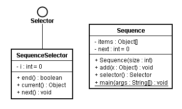

内部类典型用法：将内部类作为外部类某个方法的返回值类型。下面的迭代器（iterator）模式就是这样，程序在P191页。



```java
// : innerclasses/Sequence.java

// Holds a sequence of Objects.

interface Selector {
  boolean end();
  Object current();
  void next();
}  


public class Sequence {
  private Object[] items;
  private int next = 0;
  public Sequence(int size) {
    items = new Object[size];
  }

  public void add(Object x) {
    if (next < items.length) {
      items[next++] = x;
    }
  }
  private class SequenceSelector implements Selector {
    private int i = 0;
    public boolean end() {
      return i == items.length;
    }

    public Object current() {
      return items[i];
    }

    public void next() {
      if (i < items.length) {
        i++;
      }
    }
  }
  public Selector selector() {
    return new SequenceSelector();
  }  

  public static void main(String[] args) {
    Sequence sequence = new Sequence(10);

    for (int i = 0; i < 10; i++) {
      sequence.add(Integer.toString(i));
    }
    Selector selector = sequence.selector();

    while (!selector.end()) {
      System.out.print(selector.current() + " ");
      selector.next();
    }
  }
} /* Output:
 0 1 2 3 4 5 6 7 8 9
 */
// :~
```
