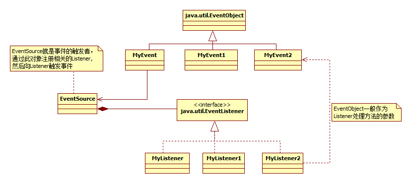
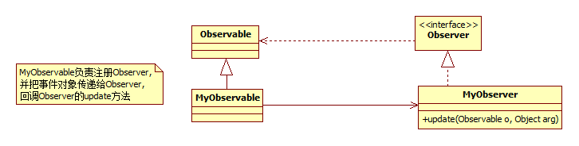

## 概述

观察者模式（Observer）又叫发布-订阅(Publish/Subscribe)模式、模型-视图 (Model/View)模式、源-监听器(Source/Listener)模式或从属者(Dependents)模式。观察者模式让多个观察者对象同时监听某一个主题对象，这个主题对象在状态上发生变化时，会通知所有观察者对象，使它们能够自动更新自己。

- 案例
    - 在图形化设计的软件中，为了实现视图和事件处理的分离，大多都采用了 Observer模式，比如java的Swing。
    - spring框架的初始化会触发很多事件，监听者可以根据自己订阅的事件作出自己的反应。
jdk不仅提供了Observable类、Observer接口支持观察者模式，而且也提供了EventObject类、EventListener接口来支持事件监听模式，虽然两者属于同一类型模式，都属于回调机制，主动推送消息，但使用场景有些区别。 

## 1．事件-监听机制
事件源经过事件的封装传给监听器，当事件源触发事件后，监听器接收到事件对象可以回调事件的方法。

## 2．观察者模式
观察者(Observer)相当于事件监听者（监听器），被观察者(Observable)相当于事件源和事件，执行逻辑时通知observer即可触发oberver的update,同时可传被观察者和参数。简化了事件-监听模式的实现。 

## 3．对比
- （1） 从uml图上也可以看出，Observer的实现相对简单，event-listener需要实现三个角色，observer-observable需要实现两个角色。 
- （2）Observable的api已经把对观察者的注册，删除等定义好了，而且是线程安全的。而event-listener需要使用者自己实现。 
- （3）两者都需要自己定义并实现触发事件的通知。但Observable需要注意要在通知Observer之前调用jdk提供的setChanged()。  

## 实例
- [java事件处理机制](http://blog.csdn.net/xiaolang85/article/details/5316859)
- [Java应用Observer接口实践Observer模式](http://blog.51cto.com/zhangjunhd/68949)