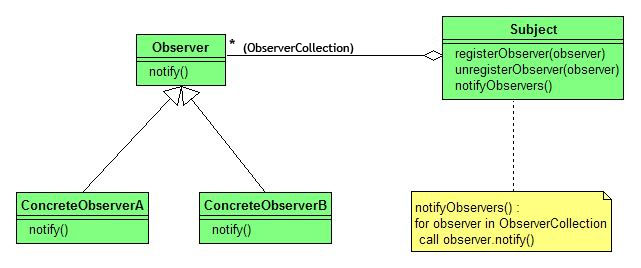

## Observer模式的概念

Observer模式是行为模式之一，它的作用是当一个对象的状态发生变化时，能够自动通知其他关联对象，自动刷新对象状态。
Observer模式提供给关联对象一种同步通信的手段，使某个对象与依赖它的其他对象之间保持状态同步。

## Observer模式的典型应用

- 侦听事件驱动程序设计中的外部事件
- 侦听/监视某个对象的状态变化
- 发布者/订阅者(publisher/subscriber)模型中，当一个外部事件（新的产品，消息的出现等等）被触发时，通知邮件列表中的订阅者

## Observer模式的优点

- 对象之间可以进行同步通信
- 可以同时通知一到多个关联对象
- 对象之间的关系以松耦合的形式组合，互不依赖

## Observer模式的结构



## Observer模式的角色：
- Subject（被观察者）
    被观察的对象。当需要被观察的状态发生变化时，需要通知队列中所有观察者对象。Subject需要维持（添加，删除，通知）一个观察者对象的队列列表。
- ConcreteSubject
    被观察者的具体实现。包含一些基本的属性状态及其他操作。
- Observer（观察者）
    接口或抽象类。当Subject的状态发生变化时，Observer对象将通过一个callback函数得到通知。
- ConcreteObserver
    观察者的具体实现。得到通知后将完成一些具体的业务逻辑处理。


## JDK对Observer模式的支持
- 通过java.util.Observable类扮演Subject角色，一个类只需通过继承java.util.Observable类便可担当ConcreteSubject角色；
- 通过java.util.Observer接口扮演Observer角色，一个类只需实现java.util.Observer接口便可担当ConcreteObserver角色。
- java.util.Observable的实现类通过调用setChanged()方法以及notifyObservers(Object)方法便可简单地通知Observer。
   当然，我们也可以不使用JDK提供的类与接口而自己实现Observer模式。

## Observer模式的应用范例

下面，我们使用JDK提供的接口与类来实现一个Observer模式用来模拟新闻订阅操作：当一个新闻被发表时，系统一方面需要通知管理者审阅；另一方面需要通知订阅者。

### 文件一览：
- Client
      测试类。
- NewsPublisher
      相当于ConcreteSubject角色。该类继承相当于Subject角色的java.util.Observable类。
- SubscriberObserver
      相当于ConcreteObserver角色。该类实现了相当于Observer角色的java.util.Observer接口。当NewsPublisher对象发生变化时得到通知，并向订阅者发送订阅邮件。
- ManagerObserver
      相当于ConcreteObserver角色。该类实现了相当于Observer角色的java.util.Observer接口。当NewsPublisher对象发生变化时得到通知，并向管理者发送消息邮件。
- News
      封装了新闻数据的类，与Observer模式无直接关系。

```java
import java.util.Observable;
import java.util.Observer;

public class Client {

    /**
     * Test Observer Pattern
     * --
     *
     */
    public static void main(String[] args) {
        NewsPublisher publisher = new NewsPublisher();
        //添加观察者对象
        publisher.addObserver(new SubscriberObserver());
        publisher.addObserver(new ManagerObserver());
        
        //发布新闻，触发通知事件
        publisher.publishNews("Hello news", "news body");
    }
}


/**
 * Subject ROLE
 * NewsPublisher: news publisher
 *
 */
class NewsPublisher extends Observable {
    public void publishNews(String newsTitle, String newsBody) {
        News news = new News(newsTitle, newsBody);
        setChanged();       //通过setChanged()方法标明对象的状态已发生变化
        
        System.out.println("News published:" + newsTitle);
        this.notifyObservers(news);   //通知各Observer，并发送一个名为news对象的消息
        
        //other process ... such as save news to database
    }
}

/**
 * Observer ROLE
 *
 */
class SubscriberObserver implements Observer {
    
    public void update(Observable observee, Object param) {
        if (param instanceof News) {
            mail2Subscriber((News)param);
        }
    }
    
    private void mail2Subscriber(News news) {
        System.out.println("Mail to subscriber. A news published with title:" + news.getTitle());
    }
}

/**
 * Observer ROLE
 *
 */
class ManagerObserver implements Observer {
    
    public void update(Observable observee, Object param) {
        if (param instanceof News) {
            mail2Manager((News)param);
        }
    }
    
    private void mail2Manager(News news) {
        System.out.println("Mail to Manager. A news published with title:" + news.getTitle());
    }
}

//data entity
class News {
    private String title;
    private String body;
    
    public News(String title, String body) {
        this.title = title;
        this.body = body;
    }
    
    public String getBody() {
        return body;
    }
    public void setBody(String body) {
        this.body = body;
    }
    public String getTitle() {
        return title;
    }
    public void setTitle(String title) {
        this.title = title;
    }
}
```

执行Client，输出结果：

> C:\Observer>javac *.java
> C:\Observer>java Client
> News published:Hello news
> Mail to Manager. A news published with title:Hello news
> Mail to subscriber. A news published with title:Hello news
> C:\Observer>
> NewsPublisher通过setChanged()与notifyObservers(Object)方法通知Observer对象SubscriberObserver与ManagerObserver。


## 不使用JDK支持的情况下的代码

Observer模式的好处是：它解除了观察者和目标之间的耦合关系。目标不需要知道它的观察者的任何信息。相反，目标只是允许观察者订阅事件。当目标产生一个事件时，它简单地将事件传给每一个观察者。

看看下面的Java示例：
```java
public interface Subject {
	// 增加Subject
    public void addObserver( Observer o );
    // 删除Subject
    public void removeObserver( Observer o );
}

public interface Observer {
	// update方法使Subject可以发送更新消息给Observer
	public void update( Subject o );
}
```

下面看看Subject的一个简单的实现--IntegerDataBag：

```java
import java.util.ArrayList;
import java.util.Iterator;

/**
 * IntegerDataBag适用于使用Integer的场合。IntegerDataBag也允许Observer增加和删除它们自身。
 */
public class IntegerDataBag implements Subject {
    private ArrayList list = new ArrayList();
    private ArrayList observers = new ArrayList();
    public void add( Integer i ) {
        list.add( i );
        notifyObservers();
    }
    public Iterator iterator() {
         return list.iterator();
    }
    public Integer remove( int index ) {
        if( index < list.size() ) {
            Integer i = (Integer) list.remove( index );
            notifyObservers();
            return i;
        }
        return null;
    }
    public void addObserver( Observer o ) {
        observers.add( o );
    }
    public void removeObserver( Observer o ) {
        observers.remove( o );
    }
    private void notifyObservers() {
        // loop through and notify each observer
        Iterator i = observers.iterator();
        while( i.hasNext() ) {
            Observer o = ( Observer ) i.next();
            o.update( this );
        }
    }
}
```

再看看两个Observer的实现--IntegerAdder和IntegerPrinter：

```java
import java.util.Iterator;
public class IntegerAdder implements Observer {
      private IntegerDataBag bag;
      public IntegerAdder( IntegerDataBag bag ) {
            this.bag = bag;              
            bag.addObserver( this );
      }
      public void update( Subject o ) {
            if( o == bag ) {
                  System.out.println( "The contents of the IntegerDataBag have changed." );
                  int counter = 0;
                  Iterator i = bag.iterator();
                  while( i.hasNext() ) {
                        Integer integer = ( Integer ) i.next();
                        counter+=integer.intValue();
                  }
                  System.out.println( "The new sum of the integers is: " + counter );
            }
      }
}

import java.util.Iterator;
public class IntegerPrinter implements Observer {
      private IntegerDataBag bag;
      public IntegerPrinter( IntegerDataBag bag ) {
            this.bag = bag;              
            bag.addObserver( this );
      }
      public void update( Subject o ) {
            if( o == bag ) {
                  System.out.println( "The contents of the IntegerDataBag have changed." );
                  System.out.println( "The new contents of the IntegerDataBag contains:" );
                  Iterator i = bag.iterator();
                  while( i.hasNext() ) {
                        System.out.println( i.next() );
                  }
            }
      }
}
```

IntegerAdder和IntegerPrinter将自己作为观察者增加到IntegerDataBag。当IntegerAdder接收到一条更新消息时，它先统计bag中的总数，然后显示结果。同样，当IntegerPrinter接收到一条更新消息时，它打印出bag中的 Interger。

下面是一个简单的main()，它使用了上面的几个类：
```java
public class Driver {
      public static void main( String [] args ) {
            Integer i1 = new Integer( 1 ); Integer i2 = new Integer( 2 );
            Integer i3 = new Integer( 3 ); Integer i4 = new Integer( 4 );
            Integer i5 = new Integer( 5 ); Integer i6 = new Integer( 6 );
            Integer i7 = new Integer( 7 ); Integer i8 = new Integer( 8 );
            Integer i9 = new Integer( 9 );
            IntegerDataBag bag = new IntegerDataBag();
            bag.add( i1 ); bag.add( i2 ); bag.add( i3 ); bag.add( i4 );
            bag.add( i5 ); bag.add( i6 ); bag.add( i7 ); bag.add( i8 );
            IntegerAdder adder = new IntegerAdder( bag );
            IntegerPrinter printer = new IntegerPrinter( bag );
            // adder and printer add themselves to the bag
            System.out.println( "About to add another integer to the bag:" );
            bag.add( i9 );
            System.out.println("");
            System.out.println("About to remove an integer from the bag:");
            bag.remove( 0 );
      }
}
```

Java 本身有大量使用Observer模式的例子：AWT/Swing事件模型，还有java.util.Observer和 java.util.Observable接口等，都是很好的例子。