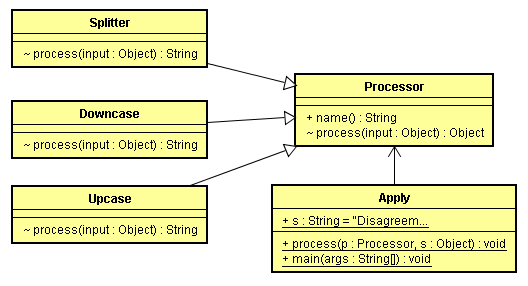

向本例这样，根据传递的不同参数，创建具有不同行为的方法，被称为策略模式。例子中，Upcase，Downcase，Splitter都是不同的策略。程序在P175页。




```java
// : interfaces/classprocessor/Apply.java

import java.util.*;
import static net.mindview.util.Print.*;

class Processor {
 public String name() {
   return getClass().getSimpleName();
 }

 Object process(Object input) {
   return input;
 }
} 

class Upcase extends Processor {
 String process(Object input) { // Covariant return
   return ((String) input).toUpperCase();
 }
}

class Downcase extends Processor {
 String process(Object input) {
   return ((String) input).toLowerCase();
 }
}

class Splitter extends Processor {
 String process(Object input) {
   // The split() argument divides a String into pieces:
   return Arrays.toString(((String) input).split(" "));
 }
} 

public class Apply {
 public static void process(Processor p, Object s) {
   print("Using Processor " + p.name());
   print(p.process(s));
 }
 public static String s = "Disagreement with beliefs is by definition incorrect";
 public static void main(String[] args) {
   process(new Upcase(), s);
   process(new Downcase(), s);
   process(new Splitter(), s);
 }
} /* Output:
 Using Processor Upcase
 DISAGREEMENT WITH BELIEFS IS BY DEFINITION INCORRECT
 Using Processor Downcase
 disagreement with beliefs is by definition incorrect
 Using Processor Splitter
 [Disagreement, with, beliefs, is, by, definition, incorrect]
 *// / :~
```